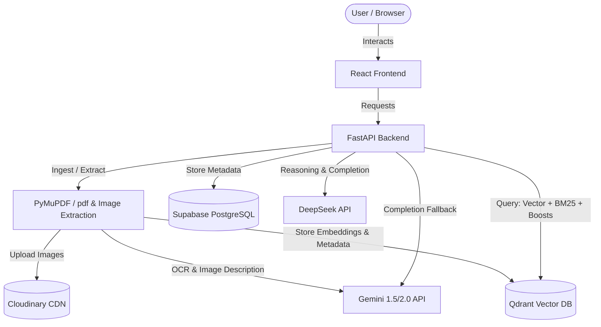

# Multimodal RAG Agent

A production-grade, end-to-end Multimodal Retrieval-Augmented Generation (RAG) application. The system processes PDF documents by extracting text, tables, and images, index them in Qdrant vector database, and uses a hybrid retrieval model (dense vector + BM25) combined with DeepSeek (or a Gemini fallback) to answer user queries. It features a modern, responsive React frontend.

## 🌟 Key Features

- **Multimodal PDF Ingestion**: Extracts text, structured tables (converted to Markdown), and embedded images from PDFs. It uses Gemini for OCR on scanned pages and generating descriptive captions for images.
- **Cloud Image Storage**: Uploads extracted PDF images to Cloudinary and stores references in Qdrant for seamless rendering.
- **Hybrid Retrieval & Reranking**: Combines dense vector search with BM25 lexical search. When image-related keywords or intents are detected, the search automatically initiates a dedicated image vector search and boosts image/figure payloads.
- **Adaptive Context Expansion**: Dynamically expands retrieved chunks with neighboring pages, prioritizing relevant tables and images, and increasing context window limits when answering visual queries.
- **DeepSeek Reasoning & Fallback**: Integrates DeepSeek (`deepseek-v4-flash` / `deepseek-v4-pro`) for high-quality chain-of-thought answers. Automatically falls back to Gemini if the DeepSeek API key is absent.
- **Collapsible Thinking Accordion**: The frontend features a beautiful, custom-styled accordion that streams DeepSeek's thinking process in real-time with a pulsing brain animation, then automatically collapses once the final answer begins.
- **Responsive & Premium UI**: Built with React, Vite, and Vanilla CSS, offering a clean layout, dark/light theme support, interactive citation badges, and image lightboxes.
- **Persistent Storage**: Utilizes Supabase (PostgreSQL) to store chat sessions, message histories, and document metadata.

---

## 🏗️ Architecture Overview



---

## 🚀 Getting Started

### Prerequisites
- Node.js (v18+)
- Python (3.10+)
- Accounts and API keys for:
  - Gemini API (Google AI Studio)
  - DeepSeek API (Optional)
  - Qdrant Cloud (or local instance)
  - Cloudinary
  - Supabase
  - Clerk (Authentication)

---

### Backend Setup (`RagAgent`)

1. **Navigate to the backend directory**:
   ```bash
   cd RagAgent
   ```

2. **Create and activate a virtual environment**:
   ```bash
   python -m venv venv
   # On Windows:
   .\venv\Scripts\activate
   # On macOS/Linux:
   source venv/bin/activate
   ```

3. **Install dependencies**:
   ```bash
   pip install -r requirements.txt
   ```

4. **Configure Environment Variables**:
   Create a `.env` file in the `RagAgent/` folder with the following content:
   ```env
   GEMINI_API_KEY="your-gemini-api-key"
   DEEPSEEK_API_KEY="your-deepseek-api-key" # Optional, falls back to Gemini if empty
   QDRANT_URL="your-qdrant-url"
   QDRANT_API_KEY="your-qdrant-api-key"
   CLOUDINARY_CLOUD_NAME="your-cloudinary-cloud-name"
   CLOUDINARY_API_KEY="your-cloudinary-api-key"
   CLOUDINARY_API_SECRET="your-cloudinary-api-secret"
   SUPABASE_DATABASE_URL="your-supabase-db-url"
   CLERK_SECRET_KEY="your-clerk-secret-key"
   ```

5. **Start the server**:
   ```bash
   python -m uvicorn main:app --host 127.0.0.1 --port 8000 --reload
   ```

---

### Frontend Setup (`Rag agent client`)

1. **Navigate to the frontend directory**:
   ```bash
   cd "Rag agent client"
   ```

2. **Install dependencies**:
   ```bash
   npm install
   ```

3. **Configure Environment Variables**:
   Create a `.env` file in the `Rag agent client/` folder:
   ```env
   VITE_CLERK_PUBLISHABLE_KEY="your-clerk-publishable-key"
   VITE_API_BASE_URL="http://localhost:8000"
   ```

4. **Start the development server**:
   ```bash
   npm run dev
   ```
   Open [http://localhost:5173](http://localhost:5173) in your browser.

---

## 📂 Project Structure

```
MRE2.0/
├── RagAgent/                     # Python FastAPI Backend
│   ├── app/
│   │   ├── agent.py              # LLM logic & stream formatting
│   │   ├── api.py                # API endpoints (Upload, Chat, etc.)
│   │   ├── config.py             # App configuration
│   │   ├── database.py           # DB and Qdrant clients
│   │   ├── deepseek_client.py    # OpenAI-compatible DeepSeek client
│   │   ├── genai_client.py       # Google GenAI client
│   │   ├── ingest.py             # PDF parsing, OCR, and embedding pipeline
│   │   ├── models.py             # SQL Alchemy DB models
│   │   ├── schemas.py            # Pydantic schemas
│   │   └── tools.py              # Search, BM25, and Reranking logic
│   ├── main.py                   # App entrypoint
│   └── requirements.txt          # Python dependencies
│
└── Rag agent client/             # React + Vite Frontend
    ├── src/
    │   ├── components/
    │   │   ├── ChatInterface.jsx # Chat container, message list, & toggle
    │   │   ├── FileUpload.jsx    # Drag-and-drop document upload
    │   │   └── MessageBubble.jsx # Message renderer with custom accordion & lightbox
    │   ├── index.css             # Main styling system (theme variables, layout, markdown overrides)
    │   └── main.jsx              # React app entrypoint
    ├── package.json              # NPM dependencies
    └── vite.config.js            # Vite configuration
```

---

## 🛠️ Customizing Settings

All configuration properties are located in `RagAgent/app/config.py`. Key adjustable variables include:
- `VECTOR_SEARCH_LIMIT`: Maximum candidate chunks fetched from Qdrant vector search (default: `50`).
- `FINAL_CONTEXT_LIMIT`: Anchor chunks used for neighbor context expansion (default: `15`).
- `EXPANDED_CONTEXT_LIMIT`: Total maximum chunks passed to the LLM (default: `24`).
- `ENABLE_LLM_RERANKER`: Enable/disable the Gemini-powered reranking step (default: `True`).
- `ENABLE_IMAGE_TEXT_EXTRACTION`: Generate descriptive captions for images during ingestion (default: `True`).
- `ENABLE_GEMINI_OCR`: OCR scanned PDF pages when they contain little or no selectable text (default: `True`).
