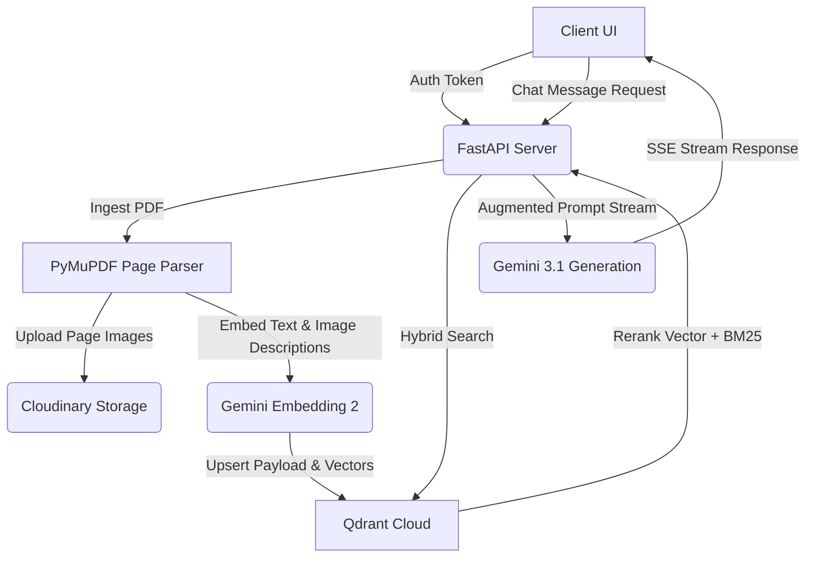

# Developer Documentation: Agentic Multimodal RAG Engine

This document provides a comprehensive technical overview of the **Agentic Multimodal RAG Engine** codebase, explaining its features, system architecture, core implementation details, and backend/frontend designs.

---

## 1. Overview
The **Agentic Multimodal RAG Engine** is a full-stack, vision-native Retrieval-Augmented Generation (RAG) application. It allows users to create chat sessions, upload PDF documents, and converse with an AI agent capable of reasoning across both text content and high-resolution embedded document images (such as charts, diagrams, tables, and formulas).

### Core Stack:
* **Backend**: FastAPI (Python), SQLAlchemy (Supabase PostgreSQL), Qdrant Cloud (Vector DB), Cloudinary (Image Hosting).
* **Frontend**: React (Vite), Clerk (Authentication), Vanilla CSS (premium dark/light styling).
* **AI Models**: Gemini 3.1 Flash-Lite (generation), Gemini Embedding 2 (vectors).

---

## 2. System Architecture

---

## 3. Core Features & Technical Implementation

### A. Multimodal Ingestion Pipeline (`RagAgent/app/ingest.py`)
When a PDF is uploaded to a chat, the ingestion pipeline processes pages asynchronously:
1. **Text Extraction**: Uses **PyMuPDF** (`fitz`) to extract native text content.
2. **OCR Fallback**: If a page has little or no selectable text (e.g. scanned PDFs), it triggers **Gemini OCR** fallback (`ENABLE_GEMINI_OCR`) to extract tabular, heading, and bulleted text from page snapshots.
3. **Image Processing & Upload**:
   * Detects embedded graphics and extracts them.
   * Uploads extracted images to **Cloudinary** under a filename prefix `[document_id]_page[num]_img[idx]`.
   * Passes image binaries to Gemini to generate descriptive, searchable alt-text.
4. **Vector Database Ingestion**:
   * Text segments and image descriptions are chunked and batched to **Gemini Embedding 2** to generate **3072-dimensional** vectors.
   * Points containing both vector embeddings and rich metadata payloads (`chat_id`, `document_id`, `text_content`, `image_url`, `page_number`, `source`) are upserted into **Qdrant Cloud**.

### B. Hybrid Search & Reranking (`RagAgent/app/tools.py`)
To maximize recall across highly formatting-dense documents, the retrieval tool merges semantic and keyword searches:
1. **Semantic Vector Search**: Generates an embedding of the query and queries Qdrant with a cosine-similarity threshold, scoped by `chat_id`.
2. **Lexical BM25 Search**: Fetches payload records for the chat and computes custom BM25 scores locally on tokenized content.
3. **Reciprocal Rank Fusion (RRF)**: Normalizes and blends vector and lexical scores, applying heuristic boosts for text matches (favoring structured reading) and OCR/Image sources.
4. **Context Augmentation**: Returns the top 15 (`FINAL_CONTEXT_LIMIT`) highest-scoring text/image points to feed into the generation prompt.

### C. Client-Side Caching (Stale-While-Revalidate + LRU)
To prevent server database read bottlenecks and ensure page loads are instantaneous, the client implements a dual caching strategy:
1. **Sidebar Chats Cache**: Scoped by Clerk user ID (`rag_chats_${userId}`). Instantly renders active chats from the previous session on mount, updating silently once the background API request completes.
2. **Messages Cache**: Scoped by chat and user ID (`rag_messages_${userId}_${chatId}`). Switching chats renders conversation logs instantly. 
3. **Write Protection**: Sync hooks pause during AI generation to keep `localStorage` write blocks away from streaming threads.
4. **Least Recently Used (LRU) Eviction**: Capping local caches to **10 chats** using a metadata-tracking queue (`rag_cached_chats_metadata_${userId}`). Opening more chats evicts the oldest messages cache from the browser's storage, preventing quota errors.

---

## 4. Backend Implementation Details

### Database Schema (`RagAgent/app/models.py`)
Uses SQLAlchemy models connecting to Supabase PostgreSQL:
* **Chat**: `id` (UUID), `user_id` (Indexed), `title`, `created_at`.
* **Document**: `id` (UUID), `chat_id` (Indexed ForeignKey, Cascade Delete), `filename`, `created_at`.
* **Message**: `id` (UUID), `chat_id` (Indexed ForeignKey, Cascade Delete), `role` (user/model), `text`, `created_at`.

*Note: Custom startup DDL execution is implemented inside `app/database.py` to index the foreign keys immediately if the tables already exist on Supabase, ensuring delete cascades are fast and don't trigger table-scans.*

### Background Cleanup Tasks (`RagAgent/app/api.py`)
When a chat or document is deleted:
* **SQLite/Postgres records** are deleted synchronously so the client UI updates immediately without showing stale records.
* **External assets** (Qdrant vectors and Cloudinary images) are cleaned up asynchronously using FastAPI's `BackgroundTasks` via a shared `_cleanup_cloudinary_images` utility, keeping API responses fast.

---

## 5. Frontend Implementation Details

### A. Centralized Request Hook (`src/hooks/useAuthFetch.js`)
To dry up code and avoid writing duplicate Clerk token fetches in every component, we created `useAuthFetch`:
* Retrieves active bearer JWT tokens via `useAuth().getToken()`.
* Automatically identifies standard request parameters and appends headers (`Authorization` and `Content-Type: application/json` where appropriate).
* Parses errors out of JSON backend payloads.
* Returns raw `Response` streams for text streams (enabling Server-Sent Events).

### B. Smooth Text Streaming (`src/components/MessageBubble.jsx`)
To make AI token generation look extremely fluid, we animate incoming stream text using the `useSmoothStreamingText` hook:
* Reads target text and appends characters in steps inside `requestAnimationFrame` ticks.
* Prevents typing lag or visual jumps even when the streaming API sends text in large, irregular chunks.

---

## 6. Deployment (`render.yaml`)
The project contains a Render Blueprint defining:
1. **rag-agent-backend**: A Python FastAPI web service building with `pip install -r requirements.txt` and starting via `uvicorn main:app --host 0.0.0.0 --port 8000`.
2. **rag-agent-frontend**: A Node.js static site building via `npm run build` and serving the Vite `dist/` bundle.
