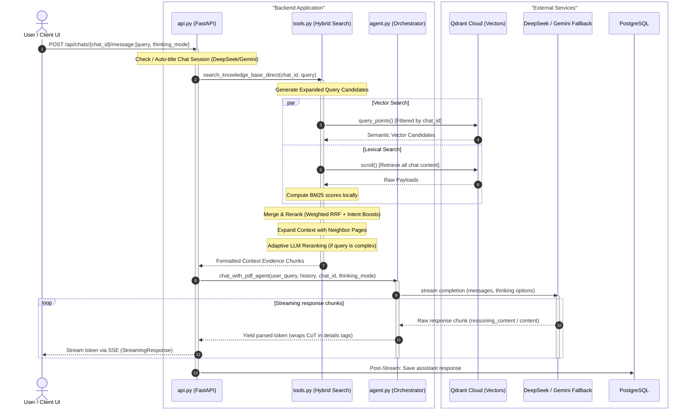
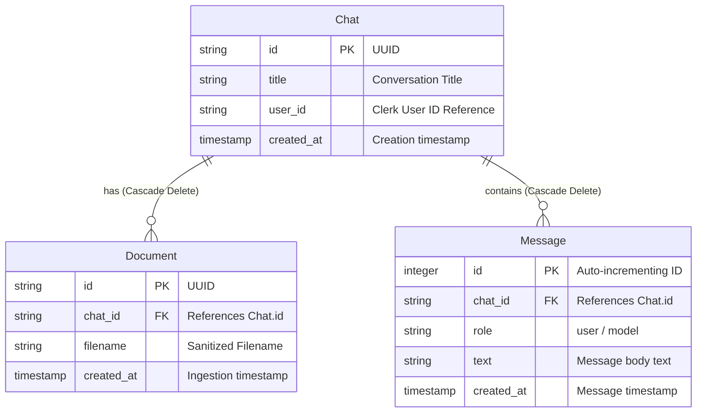

This is a full stack vision native agentic multimodal RAG engine.
It lets users create chat sessions , upload PDF documents and interact with an AI agent capable of reasoning over both text content and high resolution document images (such as charts, diagrams, tables etc)

---

# SYSTEM ARCHITECTURE

## Ingestion Pipeline Architecture (Write Path)
When a user uploads a PDF document to a chat session, the following sequence occurs:

1. **Metadata Persistence & Validation**: The FastAPI backend handles the initial upload trigger within `api.py`, performing validation before executing a synchronous write of document records to Supabase PostgreSQL utilizing SQLAlchemy ORM (`models.py`).
2. **PDF Parsing**: The document is processed in `ingest.py` using PyMuPDF (`fitz`).
3. **Text Extraction**: It attempts to extract native textual content from each page.
4. **OCR Fallback**: If a page is detected to contain scanned images or minimal selectable text, it calls Gemini OCR to parse tables, headings, and visual text structures from a page screenshot.
5. **Image Extraction & Description**: Any embedded graphics/charts on the pages are extracted as separate images:
   * Images are uploaded to Cloudinary under a strict naming convention `[doc_id]_page[num]_img[idx]`.
   * Gemini is used to generate a rich descriptive caption (alt-text) for each uploaded image.
6. **Vectorization & Upserting**: The extracted text chunks and image descriptions are vectorized using Gemini Embedding 2 (producing a 3072-dimensional vector representation). These vectors, alongside metadata payloads (e.g., `chat_id`, `document_id`, `text_content`, `image_url`, `page_number`, `source`), are then batch-upserted to Qdrant Cloud.

---

## Retrieval & Generation Pipeline Architecture (Read Path)
When a user types a query in the chat UI, the backend processes the request using an Agentic Loop:

1. **Rule-Based Query Expansion**: The user's query is analyzed in `tools.py` to check if they are looking for tables, images, or multi-page summaries. The retrieval tool generates search-expanded query variations to maximize context recall.
2. **Hybrid Retrieval (Vector + BM25)**: Rather than relying solely on vector search, the engine merges two search methodologies:
   * **Semantic Search**: Embeds the user query and queries Qdrant using cosine similarity, filtered by the current `chat_id`.
   * **Lexical Search**: Scrolls and fetches payloads matching the chat ID in Qdrant, running a local BM25 scoring algorithm on the tokenized terms.
3. **Reciprocal Rank Fusion (RRF)**: Scores from semantic and lexical searches are blended using RRF. Context sources containing OCR data or images are given a heuristic score boost. The top 15 highest-scoring contexts are selected.
4. **Agent Assembly & LLM Generation**: In `agent.py`, the query and context blocks are formatted and sent to DeepSeek (defaulting to `deepseek-v4-flash`, with `deepseek-v4-pro` support) as a completion stream. If the DeepSeek API key is absent, the engine automatically falls back to Gemini.
5. **Streaming & UI Animation**: The FastAPI backend streams the completion back to the client via Server-Sent Events (SSE). If "Thinking Mode" is checked in the UI, the model's chain-of-thought (`reasoning_content`) is streamed first, wrapped inside a collapsible Markdown `<details>` block, followed by the final answer. `ChatInterface.jsx` and `MessageBubble.jsx` animate the token rendering in real-time.

---

## Data Flow Sequence Diagram (Read Path)



---

## Storage Architecture
The codebase leverages a hybrid database architecture:

* **Supabase PostgreSQL (Relational metadata)**: Contains structured data for Chat, Document, and Message records. It enforces Referential Integrity (Cascading Deletes), ensuring that deleting a chat automatically purges its messages and documents.
* **Qdrant Cloud (Vector Database)**: Holds the high-dimensional document chunk vectors. It is decoupled from the SQL database to support lightning-fast vector similarity operations.
* **Cloudinary (Object Storage)**: Used as an external CDN to host high-resolution page visual representations and graphics.

### Relational Database Schema (ERD)



---

# Project Structure

## Project Root Directory

At the root level, the project is organized into two primary workspaces (frontend and backend), deployment configurations, and audit/developer documentation.

* 📂 **`[RagAgent]`**: The Python FastAPI backend service directory.
* 📂 **`[Rag agent client]`**: The React (Vite) frontend application directory.
* 📄 **`[developer.md]`**: Developer documentation outlining system design, architecture, database schemas, and implementation choices.
* 📄 **`[code_audit.md]`**: A comprehensive security and code-quality audit file containing severe, medium, and low issues (such as JWT bypasses or synchronous loop blocks) and their corresponding fixes.
* 📄 **`[render.yaml]`**: Render Blueprint configuration used to automate production builds and deployment settings for both the frontend static site and backend API service.

---

## Backend Directory: `[RagAgent]`

The backend runs on FastAPI and Python 3. It contains configuration files and an `app/` directory containing all logic.

* 📄 **`[main.py]`**: The entry point for the FastAPI server. It initializes the app, configures CORS rules, mounts the router endpoint definitions, and sets up the base `/health` check route.
* 📄 **`requirements.txt`**: Declares external dependencies (FastAPI, PyMuPDF, Qdrant Client, SQLAlchemy, etc.) installed during the build process.
* 📂 **`[app]`**:
  * 📄 **`[api.py]`**: Defines the REST and streaming API endpoints (creating/deleting chats, uploading files, getting messages, and streaming completions).
  * 📄 **`[agent.py]`**: Holds the prompt templates (system instructions) and orchestrates the DeepSeek (or Gemini fallback) reasoning and generation stream.
  * 📄 **`[deepseek_client.py]`**: Initializes the OpenAI compatible client helper for DeepSeek connection.
  * 📄 **`[ingest.py]`**: Parses PDF documents, extracts text and embedded images, generates alt-text annotations via Gemini, and uploads files/vectors to Cloudinary and Qdrant.
  * 📄 **`[tools.py]`**: Contains search expansion rules, semantic search logic, BM25 keyword calculation, and Reciprocal Rank Fusion (RRF) search merging.
  * 📄 **`[auth.py]`**: Implements Clerk JSON Web Token (JWT) token decoding and validation for API route protection.
  * 📄 **`[config.py]`**: App configurations (connection strings, API keys, model selections) loaded from env variables using Pydantic.
  * 📄 **`[database.py]`**: Instantiates connections to Supabase PostgreSQL and Qdrant Cloud, establishing database sessions and vector schemas.
  * 📄 **`[models.py]`**: Contains SQLAlchemy relational schema mappings (Chat, Document, and Message tables).
  * 📄 **`[schemas.py]`**: Holds Pydantic schemas representing request and response shapes.
  * 📄 **`[genai_client.py]`**: Initializes the standard Google GenAI SDK client helper.
  * 📄 **`[utils.py]`**: Helper functions (such as exponential backoff retries for third-party API calls).

---

## Frontend Directory: `[Rag agent client]`

The frontend is a modern React application built on top of the Vite bundler.

* 📄 **`[index.html]`**: The core HTML container template.
* 📄 **`package.json` / `package-lock.json`**: Declares and pins frontend node packages (React, Clerk SDK, Lucid React icons, etc.).
* 📄 **`vite.config.js` / `eslint.config.js`**: Configuration blueprints for the Vite dev-server/bundler and ESLint rules.
* 📂 **`[src]`**:
  * 📄 **`[main.jsx]`**: The application bootstrap file. It initializes the React DOM tree and wraps it with Clerk's `<ClerkProvider>` context.
  * 📄 **`[App.jsx]`**: The root UI layout containing the global states (active chat, theme, sidebar lists) and layout structures.
  * 📄 **`[index.css]`**: Core stylesheet containing variables (such as shadows, color tokens, and active transitions), resets, and custom scrollbars.
  * 📄 **`[api.js]`**: Sets up the base backend API URL configuration.
  * 📂 **`components`**:
    * 📄 **`[ChatInterface.jsx]`**: Handles chat messaging logic, input handling, and LocalStorage caching.
    * 📄 **`[MessageBubble.jsx]`**: Renders user/agent messages and handles the smooth text streaming animation.
    * 📄 **`[FileUpload.jsx]`**: Renders the file drop-zone area and controls upload statuses.
  * 📂 **`hooks`**:
    * 📄 **`[useAuthFetch.js]`**: A custom wrapper around the native fetch API. It automatically requests the JWT authentication token from Clerk and appends it to request headers.
  * 📂 **`utils`**:
    * 📄 **`[chatUtils.js]`**: Simple utilities (such as identifying temporary chat IDs).

---

# Group 1: App Settings & Server Initialization

### `config.py`
This file is the configuration hub of the backend application. It is built using `pydantic-settings` to load and validate environment variables from the `.env` file.

**Key Responsibilities**:
* Loads required variables such as API keys , database connection strings , and credentials.
* Defines RAG retrieval knobs such as `VECTOR_SEARCH_LIMIT` (how many vectors to query from Qdrant), `FINAL_CONTEXT_LIMIT` (how many documents to feed the generator), and `LEXICAL_SCAN_LIMIT` (lexical index scan limit).
* Exposes pipeline flags like `ENABLE_GEMINI_OCR` (triggering OCR for scanned PDFs) and `ENABLE_LLM_RERANKER` (using Gemini to double-check search context).
* Cloudinary Initialization: Integrates Cloudinary setup directly.

### `genai_client.py`
This is a micro-module whose sole responsibility is to instantiate the official Google GenAI SDK client.

**Key Responsibilities**:
* Centralizes the client instance (`client`). Importing `client` from this file guarantees that we share a single client reference throughout the backend, avoiding multiple initialization calls.

---

### `utils.py`
This utility module contains a crucial helper function: `call_with_retry`.

**Key Responsibilities**:
* **Rate-Limit Backoff**: The free tier of the Gemini API has a limit of 15 requests per minute. If the app fires requests too quickly, it receives a `429 RESOURCE_EXHAUSTED` error.
* **Retry Pattern**: The function wraps any Gemini API call in a loop with exponential backoff (e.g. waiting 2s, then 4s, then 8s...) plus a random "jitter" delay of `0.5s` to `1.5s` to prevent concurrent retry collisions.
* **Error Detection**: Specifically catches `ClientError` and inspects the payload to ensure it only retries authentic rate-limit/quota errors (Issue #10 fix: it ignores other inputs like string character limits).

### `main.py`
The primary entry point of the backend application where the FastAPI server instance is created and running.

**Key Responsibilities**:
* **Limiter Initialization**: Imports `slowapi` to enforce IP-based rate limiting on all API routes to protect the app from being spammed.
* **CORS (Cross-Origin Resource Sharing)**: Reads origin strings from configuration settings and configures middleware. This determines which frontend domains are allowed to communicate with the API.
* **Response Cache-Control**: Registers middleware to ensure that dynamic chat paths (`/api/chats` and `/api/documents`) set strict `no-store, no-cache` headers, ensuring the client browser never serves stale cached messages.
* **Secure Health Endpoint**: Defines `/health`, verifying connection status to Qdrant Cloud. If database operations fail, it logs details internally (preventing internal stack traces from leaking) and returns a clean `{"status": "unhealthy"}`.

---

## Config.py Parameters

### 1. Retrieval Bounds & Limits

* **`VECTOR_SEARCH_LIMIT: int = 50`**
  * *What it does*: Controls how many candidate text/image points the semantic vector search retrieves from Qdrant.
  * *Why it's there*: Before we combine results with keyword search (BM25) or run advanced ranking, we pull a wide net of up to 50 matching vectors from the database.
* **`FINAL_CONTEXT_LIMIT: int = 15`**
  * *What it does*: The limit of direct-match chunks from the search results that we keep.
  * *Why it's there*: It acts as the cutoff threshold. Chunks ranked below this index are excluded from the primary context list but may still be used to pull neighboring page context.
* **`EXPANDED_CONTEXT_LIMIT: int = 24`**
  * *What it does*: The maximum number of total context blocks (both direct search matches and their surrounding neighbor page chunks) passed to the Gemini prompt.
  * *Why it's there*: Prevents prompt bloat. It ensures the prompt doesn't exceed Gemini's context constraints or make the API call too slow.
* **`LEXICAL_SCAN_LIMIT: int = 2500`**
  * *What it does*: The maximum number of document chunks scrolled (fetched) from Qdrant for a single chat to calculate lexical keyword search (BM25).
  * *Why it's there*: Unlike vector search which runs on the server, BM25 scoring is calculated locally in Python memory. This caps the local search scroll to 2,500 payload objects to prevent high memory usage.

### 2. Context Window & Table Chunking

* **`CONTEXT_NEIGHBOR_PAGES: int = 1`**
  * *What it does*: The distance (in pages) to fetch surrounding context. With a value of 1, if the search matches a chunk on page 5, the engine also pulls chunks from page 4 (page 5 - 1) and page 6 (page 5 + 1).
  * *Why it's there*: Helps the model answer questions where the answer spans page boundaries, or where reading a paragraph before or after a table is necessary to understand the table.
* **`CONTEXT_CHUNKS_PER_PAGE: int = 3`**
  * *What it does*: The maximum number of adjacent page chunks to pull per neighboring page.
  * *Why it's there*: Keeps the prompt balanced by preventing a single neighboring page from flooding the context window with too many chunks.
* **`TABLE_CHUNK_MAX_CHARS: int = 6000`**
  * *What it does*: The maximum character length allowed for a table text chunk.
  * *Why it's there*: Tables are parsed into Markdown. When a Markdown table is large, a generic text splitter would break it mid-row, destroying its layout structure. The custom table splitter keeps table rows intact up to 6,000 characters.

### 3. Query Expansion

* **`ENABLE_RULE_BASED_QUERY_EXPANSION: bool = True`**
  * *What it does*: Activates automated query expansion based on query keywords.
  * *Why it's there*: If a user asks "show me the revenue chart", the engine expands the search query to include terms like "figure diagram chart caption labels". This enables the retriever to search for matching image descriptions and captions in addition to standard text.
* **`MAX_EXPANDED_SEARCH_QUERIES: int = 4`**
  * *What it does*: Limits the number of query variations generated by the query expansion rules.
  * *Why it's there*: Limits query generation to 4 variations to avoid running too many parallel vector embedding API calls and database queries.

### 4. LLM-Based Reranking

* **`ENABLE_LLM_RERANKER: bool = True`**
  * *What it does*: Toggles the secondary LLM validation step.
  * *Why it's there*: Initial searches might retrieve some irrelevant pages (noise). If enabled, the engine sends search candidates to Gemini, asking it to verify which excerpts actually help answer the question.
* **`RERANK_CANDIDATE_LIMIT: int = 30`**
  * *What it does*: The maximum number of initial search results sent to Gemini for reranking.
  * *Why it's there*: Limits the candidate list sent to the LLM to 30 items to keep latency and API token costs low.
* **`RERANK_OUTPUT_LIMIT: int = 18`**
  * *What it does*: The maximum number of LLM-validated chunks returned after reranking.
  * *Why it's there*: Caps the reranked list to 18 elements.

### 5. Document Ingestion & OCR

* **`ENABLE_GEMINI_OCR: bool = True`**
  * *What it does*: Enables visual OCR (Optical Character Recognition) fallback for pages using Gemini.
  * *Why it's there*: If a PDF is a scanned document (where text is saved as pixels rather than selectable strings), standard PDF parsers return empty strings. Setting this to True tells the system to snapshot the page and use Gemini to extract the text.
* **`ENABLE_IMAGE_TEXT_EXTRACTION: bool = True`**
  * *What it does*: Toggles the extraction of descriptive text captions for images embedded inside document pages.
  * *Why it's there*: If a page contains a diagram or chart, the engine extracts the image, uploads it to Cloudinary, and asks Gemini to write a descriptive caption (e.g., "A bar chart showing Q3 revenue..."). This text description is saved as metadata, making the image searchable.
* **`OCR_TEXT_MIN_CHARS: int = 80`**
  * *What it does*: The character threshold below which a page is considered "empty" (textless), triggering the OCR fallback.
  * *Why it's there*: If PyMuPDF extracts less than 80 characters from a page, the page is likely a scanned image, a heavy graphic layout, or a title page. Setting this minimum threshold ensures the system automatically triggers Gemini OCR to capture any missing text.

---

# Group 2: Database Schemas & Authentication

### `auth.py`
This file makes sure that only logged-in users can access the API, and that users can only see their own chats and documents.

**How it works in simple terms**:
* When a user logs in on the frontend, the authentication provider (Clerk) gives them a secure key card called a JWT (JSON Web Token).
* Every time the frontend requests data from the backend, it passes this token.
* `auth.py` intercepts this token and verifies it using Clerk's official certificates (PyJWKClient). If it's valid, it extracts the user's ID (user_id). If someone tries to send a fake token or no token, they get blocked immediately with a 401 Unauthorized error.
* In Development (DEBUG Mode): To make testing easier, it can skip signature checks if DEBUG is set to True, but it forces verification in production to keep data secure (Issue #1 fix).

### `database.py`
This file establishes and manages connections to two different databases: Supabase PostgreSQL (for chat text/metadata) and Qdrant Cloud (for vector search).

* **SQL Database Setup**: Connects to Supabase using SQLAlchemy. When the app starts, it checks if our tables exist. If they don't, it creates them. It also creates database indexes on foreign keys to make deletes extremely fast (so deleting a chat deletes its messages instantly).
* **Vector Database Setup**: Connects to Qdrant. It checks if the vector collection exists. If not, it creates a new collection configured to hold 3072-dimensional vectors (the size of Gemini Embedding 2 vectors) and sets up keyword index tags (chat_id, document_id) to speed up search filtering.

### `models.py`
This file defines what our relational database tables look like inside Supabase PostgreSQL. It uses SQLAlchemy to map Python classes to database tables.

We have three tables:
* **Chat**: Stores chat metadata (a unique ID, the user_id who owns it, the title e.g. "Project Notes", and when it was created).
* **Document**: Stores information about uploaded PDFs (a unique ID, the chat it belongs to, and the filename).
* **Message**: Stores the conversation log (the chat it belongs to, whether the sender was the user or the AI model, the text content, and the timestamp).
* **Cascade Deletes**: The tables are connected. If you delete a Chat from the database, SQLAlchemy automatically cascade-deletes all associated Message and Document records.

### `schemas.py`
This file defines the exact data formats (shapes) that our frontend and backend use to send information to each other. It uses Pydantic models.

---

# Group 3: Core RAG, Parsing, & Routing

### 1. `ingest.py`
This file is responsible for processing a PDF file when it is uploaded. It extracts both text and images, transforms them, and stores them in Qdrant and Cloudinary.

* **Text Extraction**: It reads the pages of the PDF. If a page has selectable text, it extracts it. If a page contains a table, it converts it into a clean Markdown table format.
* **OCR Fallback (Visual Reading)**: If a page is scanned (like a photo) and contains no selectable text, the pipeline snapshots the page as an image and asks Gemini to look at the image and transcribe everything it sees.
* **Image Handling**: It extracts any embedded diagrams, charts, or images on the page, uploads them to Cloudinary (our image storage), and asks Gemini to write a search description for them.
* **Vectorization**: It chops the text and descriptions into small paragraphs (chunks), sends them to Gemini Embedding 2 to convert them into numbers (vectors), and uploads those vectors to Qdrant.

### 2. `tools.py`
This file finds the most relevant pages and images in your documents to answer a user's question.

* **Query Expansion**: If you ask about a "chart," it automatically searches for "diagram," "figure," and "legend" as well.
* **Hybrid Search**:
  * **Semantic Search**: It looks for pages that match the meaning of your question using vector math in Qdrant.
  * **Keyword Search (BM25)**: It looks for pages containing the exact words of your question.
* **Reranking**: It merges these search results using a scoring system that gives extra priority to tables, images, and OCR text if the user's question mentions them.
* **AI Validation**: If the query is complex, it sends the top candidates to Gemini to filter out irrelevant matches, leaving only the best context blocks.

### 3. `agent.py`
This file is the orchestrator that combines the user's question with the retrieved document pages and generates the final response.

* **Context Assembly**: It formats all retrieved pages, tables, and images into a structured list of evidence blocks (e.g. `[Evidence 1] page=3; source=pdf_text; content="..."`).
* **Prompt Formulation**: It compiles the user's chat history, the current question, and the evidence list, adding a system prompt that instructs the AI: "Answer the user's question using only this context. Cite page numbers. Do not make up answers."
* **Stream Generation**: It sends the prompt to DeepSeek (defaulting to `deepseek-v4-flash`, with `deepseek-v4-pro` support) or falls back to Gemini if DeepSeek is not configured. If Thinking Mode is enabled, the generation stream yields the model's intermediate chain-of-thought wrapped in a `<details><summary>Thinking Process</summary>...reasoning...</details>` block. The frontend parses this block, rendering it in a premium collapsible accordion component that displays a live pulsing brain icon during active generation, automatically collapses once the thinking is complete, and can be manually expanded by the user.

---

### 4. `api.py` (The API Router)
This file defines the HTTP API endpoints that connect the React frontend with all of the backend python logic.

* **Endpoint Routing**: Defines routes like GET /chats (fetch chat list), POST /chats/{chat_id}/upload (upload PDF), and POST /chats/{chat_id}/message (send message).
* **Asynchronous Tasks**: When a chat or document is deleted, the API deletes the database metadata immediately so the UI updates instantly, and delegates deleting the files from Cloudinary and vectors from Qdrant to a background worker.
* **SSE Streaming**: When a message is sent, the API establishes a Server-Sent Events (SSE) connection to stream tokens from agent.py to the browser in real-time.

---

# Deep Dive: Core Functions in ingest.py

### `get_multimodal_embedding`
The get_multimodal_embedding function generates high-dimensional vector embeddings for either text or image content using Google's Gemini API (gemini-embedding-2-preview).

#### Function Structure and Parameters
The function signature is defined as follows:
`def get_multimodal_embedding(content: bytes | str, is_image: bool = False, mime_type: str = "image/png") -> list[float]:`

* **content (bytes | str)**: The raw data payload. It accepts a text string or raw image bytes.
* **is_image (bool)**: A flag that determines the processing pathway. It defaults to False (processed as text).
* **mime_type (str)**: Specifies the media format (such as "image/png" or "image/jpeg"). This is only utilized if is_image is set to True.
* **Returns (list[float])**: A high-dimensional vector array consisting of floating-point numbers representing the input content.

#### Operational Workflow
The function processes data sequentially through three primary steps:

* **Step 1: Payload Formatting (Conditional Logic)**:
  * **Image Pathway (if is_image is True)**: It converts the raw image bytes into a Gemini-compatible structure using `types.Part.from_bytes`. No specific configuration is applied.
  * **Text Pathway (if is_image is False)**: It passes the text string directly and configures a `types.EmbedContentConfig` with the task type set to "RETRIEVAL_DOCUMENT". This optimizes the vector coordinates specifically for document indexing and search retrieval (RAG) systems.
* **Step 2: API Invocation with Resilience**:
  * The function invokes the Gemini API using `client.models.embed_content`.
  * It explicitly targets the "gemini-embedding-2-preview" model to project both text and vision inputs into the same vector space.
  * The entire call is wrapped inside a `call_with_retry` utility function, which ensures network resilience by automatically retrying the request if hit by transient server errors or rate limits.
* **Step 3: Vector Extraction**:
  * Upon receiving the payload from the API, the function targets the first index of the returned array (`embeddings[0]`).
  * It extracts and returns the underlying numerical sequence using the `.values` attribute.

---

### `get_multimodal_embeddings_batch`
The get_multimodal_embeddings_batch function is designed to generate vector embeddings for multiple text documents simultaneously (in a single batch) using Google's Gemini API (gemini-embedding-2-preview). This is an optimized, efficient way to process a large collection of text strings for use in vector databases or Retrieval-Augmented Generation (RAG) systems.

#### Function Structure and Parameters
The function signature is defined as follows:
`def get_multimodal_embeddings_batch(contents_list: list[str]) -> list[list[float]]:`

* **contents_list (list[str])**: A Python list containing the raw text strings that you want to transform into embeddings.
* **Returns (list[list[float]])**: A list of embedding vectors. Each individual embedding vector is a list of floating-point numbers representing the mathematical definition of that specific piece of text.

#### Operational Workflow
The function processes the collection of texts through the following sequential stages:

* **Step 1: Guard Clause for Empty Input**:
  * The function immediately checks if the input contents_list is empty.
  * If there is no content to process, it safely returns an empty list ([]) to prevent unnecessary API calls and potential errors down the line.
* **Step 2: Batch Preparation via Content Wrapping**:
  * It uses a list comprehension to loop through each string in contents_list.
  * To ensure that the Gemini API recognizes the input as multiple distinct documents (rather than one giant combined document), each string is explicitly wrapped inside its own 'types.Content' object, which in turn holds a 'types.Part.from_text' object.
  * The resulting objects are saved into a new list named wrapped_contents.
* **Step 3: API Request with Optimization**:
  * The function invokes the Gemini API using `client.models.embed_content`.
  * It targets the "gemini-embedding-2-preview" model and passes the entire wrapped_contents list.
  * It passes a `types.EmbedContentConfig` setting the task_type to "RETRIEVAL_DOCUMENT". This configures the embedding model to structure the vector spaces in a way that makes these documents easily searchable in a knowledge base or RAG pipeline.
  * The request is routed through a `call_with_retry` utility to seamlessly handle API rate limits or brief network failures.
* **Step 4: Vector Extraction**:
  * The API returns a response containing an array of embedding objects matching the order of the input list.
  * The function uses a list comprehension (`[emb.values for emb in response.embeddings]`) to loop through every embedding in the response, extract its raw numeric list ('.values'), and compile them into a nested Python list to return to the user.

#### Core Advantages of this Function
* **Reduced Network Latency**: By batching all text items into a single API request, it bypasses the massive overhead and delay caused by making separate network calls for every single sentence or document.
* **Consistency**: It ensures that all documents processed in the block utilize the identical model definition and retrieval configuration constraints.

---

### `_clean_extracted_text`
A text sanitation helper that scrubs raw PDF-extracted text by replacing null bytes with spaces, compressing multiple spaces/tabs into a single space, collapsing excessive consecutive line breaks, and trimming edge whitespace.

---

### `_clean_table_cell`
A cell formatter that prepares raw cell data for Markdown tables. It handles null values, cleans the text content, escapes Markdown column delimiters (`|` becomes `\|`), and converts newlines to HTML `<br>` tags to preserve multi-line cell structures.

---

### `_table_to_markdown`
Converts a raw 2D grid of data (`list[list]`) extracted from a PDF page into a standard, visual Markdown table string.

#### Key Stages:
1. **Cleaning**: Loops through every cell and cleans it using `_clean_table_cell`. Rows that are entirely empty are filtered out.
2. **Normalization**: Handles merged or mismatched cells by finding the maximum column width and padding shorter rows with empty string values (`""`).
3. **Markdown Construction**:
   * Joins cells in each row with column dividers (` | `) and wraps them in outer pipes (`|`).
   * Inserts a standard Markdown separator row (`| --- | --- |`) below the header row.
   * Combines the header, separator, and body rows into a single string using newline separators (`\n`).

#### Code Breakdown Example:
For an input header `['Month', 'Sales']` and body `[['Jan', '100'], ['Feb', '150']]`:
1. **Line formatting**:
   * Header: `"| " + " | ".join(['Month', 'Sales']) + " |"` $\rightarrow$ `"| Month | Sales |"`
   * Separator: `"| " + " | ".join(['---', '---']) + " |"` $\rightarrow$ `"| --- | --- |"`
2. **Body looping**:
   * Row 1: `"| Jan | 100 |"`
   * Row 2: `"| Feb | 150 |"`
3. **Line joining**: Joining all lines with `\n` results in a single string block representing the Markdown table.

---

### `_split_markdown_table`
Splits a Markdown table exceeding `max_chars` into smaller chunks while duplicating the headers at the top of every chunk.

#### Key Stages:
1. **Size Check**: Returns the table as a single item if it is already smaller than `max_chars`.
2. **Prefix Extraction**: Pops lines off the top of the text until it hits a line starting with `|` (the start of the table). This isolates any introductory title text (e.g. *"Table 1: Financial Report"*).
3. **Fallback**: If the table contains fewer than 3 lines (invalid Markdown table structure), it falls back to slicing it by character count.
4. **Header Isolation**: Separates the top 2 lines (header row and separator line) from the subsequent body rows.
5. **Splitting Loop**: Loops through the data rows. If appending a row exceeds `max_chars`, it saves the current chunk and starts a new one, re-attaching the headers and separator at the top.

---

### `_extract_tables_from_page`
Detects and extracts structured table grids from a PDF page using PyMuPDF and formats them as a list of Markdown table strings.

#### Key Stages:
1. **Compatibility Check**: Checks if the installed version of PyMuPDF (`fitz`) supports the table-finding feature (`find_tables`).
2. **Table Detection**: Runs layout analysis on the page to identify cell alignments and grid borders.
3. **Data Extraction**: Extracts the raw cells as a 2D list (rows and columns) for each detected table.
4. **Markdown Conversion**: Formats each extracted grid using `_table_to_markdown` and saves the valid Markdown tables labeled by index (e.g. `Table 1:\n...`).
5. **Error Isolation**: Logs failures for individual tables while allowing the remaining tables on the page to process successfully.

---

### `_extract_page_text`
Safely extracts plain text from a PDF page, sorting text blocks into reading order and cleaning formatting anomalies.

#### Key Stages:
1. **Sorted Extraction**: Attempts to extract plain text with layout sorting (`sort=True`) to maintain natural reading order (crucial for columns and headers).
2. **Compatibility Fallback**: Catches any `TypeError` (thrown in older versions of PyMuPDF that do not support sorting parameters) and falls back to unsorted text extraction to prevent a crash.
3. **Text Sanitation**: Passes the output string through `_clean_extracted_text` to strip null bytes, duplicate spacing, and excessive blank lines.

---

### `_render_page_png`
Renders a single PDF page into a high-resolution PNG image format, returned as raw bytes in memory.

#### Key Stages:
1. **Rasterization**: Uses `get_pixmap` to take a pixel snapshot of the vector elements of the PDF page.
2. **Resolution Scaling**: Multiplies the default 72 DPI resolution up to a desired target (such as 180 DPI) using `fitz.Matrix`. This increases detail by $2.5\text{x}$, making tiny details and text crystal clear for the OCR models.
3. **Alpha Safeguard**: Sets `alpha=False` to disable transparency, forcing the page background to render as solid white instead of transparent (which would render black on black text in some systems).
4. **Byte Conversion**: Uses `tobytes("png")` to compress the pixel map into PNG byte sequences in memory, avoiding temporary local disk files.

---

### `_extract_text_from_image_bytes`
Submits raw image bytes and a processing prompt to Gemini's multimodal vision engine, returning sanitized text/descriptions.

#### Key Stages:
1. **Multimodal Packaging**: Formats the API request to include both a text part (instructions/prompt) and a binary image part (raw bytes + MIME type indicator).
2. **Resilient API Call**: Routes the request through the `call_with_retry` wrapper targeting the configured generation model (e.g. Gemini 3.1 Flash-Lite) to handle transient rate-limit errors.
3. **Response Parsing**: Extracts the model-generated text from candidate structures in the API response.
4. **Sanitation**: Sanitizes the returned text string using `_clean_extracted_text`.

---

### `_describe_image_for_search`
Generates a searchable text description for an image by sending it to Gemini with a factual cataloging prompt.

#### Key Stages:
1. **Feature Check**: Reads `ENABLE_IMAGE_TEXT_EXTRACTION` settings to determine if image descriptions are enabled, immediately returning an empty string `""` if disabled.
2. **Cataloging Prompt**: Invokes `_extract_text_from_image_bytes` using a specific prompt instructing the model to extract readable text (labels, legend, axis, numbers), describe the visual details concisely, and convert any visual grids into Markdown tables.
3. **Robust Error Handling**: Catches all exceptions during the API call, logging the failure and returning `""` to allow overall document processing to continue.

---

### `_add_text_chunks`
Slices text blocks into formatted, metadata-enriched chunks and appends them to a tracking list.

#### Key Stages:
1. **Cleaning**: Sanitizes raw text content and aborts early if the resulting string is completely empty.
2. **Conditional Split**:
   * **Tables**: Invokes `_split_markdown_table` using the configured `TABLE_CHUNK_MAX_CHARS` setting to keep table formats intact.
   * **Regular Text**: Invokes standard `RecursiveCharacterTextSplitter` to divide paragraphs at natural punctuation boundaries.
3. **Metadata Mapping**: Packs each chunk alongside context values (`page_number`, `chunk_index`, `source`, `image_url`, `entity_type`) and appends it to the running metadata tracking list.

---

### `_ocr_page_from_bytes`
Performs page-level visual OCR on a rendered page PNG image to extract verbatim text, lists, and tables when selectable text is missing.

#### Key Stages:
1. **Verbatim Transcription Prompt**: Submits the page image to `_extract_text_from_image_bytes` with a specific prompt instructing Gemini to transcribe all text verbatim, preserve list layouts, and convert table structures into Markdown tables.
2. **Page Association**: Returns a tuple containing the `page_number` and the extracted text. This allows the master ingestion loop to run OCR on multiple pages concurrently and map results back to their correct order.
3. **Failure Isolation**: Catches exceptions during API execution, logging the error and returning an empty string `""` so the rest of the document's pages can continue loading.

---

### `_process_single_image`
Processes a single extracted PDF graphic by uploading it to Cloudinary, describing it with Gemini, generating a multimodal vector, and returning a structured payload.

#### Key Stages:
1. **Isolated Media Upload**: Uploads raw image bytes to Cloudinary under a user-specific folder path (`ragagent/{user_id}`) for access security, assigning a unique `public_id` using document and page parameters.
2. **Search Description**: Calls `_describe_image_for_search` to write a text summary of the image's contents.
3. **Multimodal Embedding**: Generates a 3072-dimensional vector representation directly from the image bytes to enable visual semantic searches.
4. **Resilient Packaging**: Groups the vector, Cloudinary delivery URL, description, and source keys into a payload dictionary, returning `None` if any stage throws an exception to protect the ingestion loop.

---

### `ingest_pdf`
The central orchestrator (write path) that parses a raw PDF file, manages concurrent image and text extraction, generates vector embeddings, and stores media and vectors across PostgreSQL, Cloudinary, and Qdrant Cloud.

#### Detailed Pipeline Breakdown:

1. **Document Loading**:
   * Generates a unique UUID (`doc_id`) to identify the document.
   * Loads the PDF in memory (`fitz.open`) using PyMuPDF.

2. **ThreadPool Parallelization**:
   * Spins up a `ThreadPoolExecutor` with a maximum of 8 workers. This handles time-consuming network operations (Cloudinary uploads and Gemini OCR/description calls) concurrently.

3. **Page Iteration Loop**:
   Loops page-by-page to submit background tasks:
   * **Plain Text**: Extracts page text via `_extract_page_text` and queues it for standard paragraph chunking.
   * **Tables**: Identifies structural tables via `_extract_tables_from_page`, converts them to Markdown tables, and queues them.
   * **OCR Fallback**: If the page yields fewer than 80 characters of text (indicating a scanned page or a layout-heavy graphic), it renders the page as a PNG (`_render_page_png`) and submits it to a thread worker for Gemini visual OCR (`_ocr_page_from_bytes`). The future reference is saved in `ocr_futures`.
   * **Image Extraction**: Scans the page for embedded photos/charts, extracts the raw bytes, and submits it to a thread worker (`_process_single_image`) to upload to Cloudinary and catalog with a caption. The future reference is saved in `image_futures`.

4. **Background Task Resolution**:
   Once all pages are submitted, the main thread waits for background tasks to complete:
   * **OCR Collection**: Resolves tasks in `ocr_futures`. Valid transcribed page text is queued for paragraph chunking.
   * **Image Collection**: Resolves tasks in `image_futures`. For each processed image:
     * Appends the image's raw visual vector directly to the Qdrant upload list.
     * Queues the image's descriptive text caption (`image_text` source) for chunking, mapping it to the image's Cloudinary URL, so that the image is searchable by text.

5. **Batch Text Vectorization**:
   * Gathers all queued text chunks (PDF text, tables, OCR text, and image descriptions).
   * Groups the chunks into **batches of 100** to avoid network latency.
   * Sends each batch to Gemini's embedding API (`get_multimodal_embeddings_batch`).
   * Maps each resulting vector into a Qdrant `PointStruct` containing the chunk text and context details (e.g. `doc_id`, `chat_id`, `page_number`, `image_url`).

6. **Database Write & Resource Cleanup**:
   * **Vector Storage**: Upserts the compiled list of all text and image vectors to Qdrant Cloud.
   * **Memory Release**: The `finally` block guarantees that the PDF document object is closed (`pdf_document.close()`), preventing memory leaks on the FastAPI server. Returns the final `doc_id`.

---

# Deep Dive: Core Components in tools.py

### `TOKEN_RE`
A compiled regular expression pattern (`[a-zA-Z0-9][a-zA-Z0-9_\-./]*`) used to parse text blocks into clean, individual words (tokens) for local BM25 keyword calculation.

#### Key Rules:
* **Alphabetic Start**: Requires that each word starts with a letter or digit to ignore isolated symbols and punctuation marks.
* **Compound Preservation**: Permits characters like hyphens (`-`), underscores (`_`), periods (`.`), and slashes (`/`) in the middle of words, ensuring that filenames (e.g., `invoice.pdf`), path strings, and version formats remain intact as single terms.

---

### Keyword sets for Intent Detection
The sets `IMAGE_KEYWORDS`, `TABLE_KEYWORDS`, and `MULTI_PAGE_KEYWORDS` act as detectors that parse the user's question to identify what kind of visual or structural content they are looking for, adapting search ranking parameters accordingly.

#### Parameter Breakdowns:
* **`IMAGE_KEYWORDS`**:
  * *Keywords*: `image`, `diagram`, `chart`, `figure`, `photo`, `drawing`, etc.
  * *Purpose*: Triggers image search boost. Increases the ranking weights of visual vectors and captions from Qdrant, ensuring graphics are retrieved and rendered inside the chat.
* **`TABLE_KEYWORDS`**:
  * *Keywords*: `table`, `row`, `column`, `compare`, `matrix`, `total`, `percentage`, etc.
  * *Purpose*: Triggers table formatting priority. Boosts Markdown table matches and instructs the generation prompt to present answers in a clean Markdown table grid.
* **`MULTI_PAGE_KEYWORDS`**:
  * *Keywords*: `all`, `entire`, `summarize`, `sections`, `timeline`, `differences`, etc.
  * *Purpose*: Triggers multi-page context gathering. Signals that the answer spans across multiple document pages, activating the LLM Reranker and pulling in neighbor page contexts.

---

### `_tokenize`
Splits a string of text into a list of clean, lowercase words (tokens) using `TOKEN_RE`.

#### Key Stages:
1. **Fallback**: Safeguards against missing values by converting `None` to an empty string.
2. **Parsing**: Runs `TOKEN_RE.findall` to extract valid alphanumeric-started words.
3. **Normalization**: Converts every word to lowercase to ensure subsequent matching is case-insensitive.

---

### `_query_words`
Tokenizes a text string and returns a set containing only the unique words.

#### Key Stages:
1. **Tokenization**: Calls `_tokenize` to convert the string to a lowercase list.
2. **De-duplication**: Converts the list to a Python `set`, eliminating duplicates and enabling fast mathematical set comparisons.

---

### `_has_any`
Checks if the user's text query contains any words from a target list of keywords, returning a boolean value.

#### Key Stages:
1. **Set Comparison**: Uses set intersection (`&`) to find overlap words between the user query set (`_query_words`) and the target keyword set.
2. **Boolean Cast**: Casts the result using `bool()`, returning `True` if they share at least one keyword in common, and `False` otherwise.

---

### `_is_complex_query`
Evaluates a query string to determine if it requires advanced retrieval (activating the LLM reranker), returning a boolean value.

#### Evaluated Conditions:
* **Word Length**: True if the query has 9 or more unique words, indicating a long question.
* **Multi-Page Intent**: True if the query contains any keywords from `MULTI_PAGE_KEYWORDS` (e.g. `summarize`, `entire`).
* **Table Intent**: True if the query contains any keywords from `TABLE_KEYWORDS` (e.g. `columns`, `compare`).
* **Inquiry Structure**: True if the query contains a question mark `?` and has 6 or more words, indicating a direct question requiring context synthesis.

---

### `_expanded_queries`
Performs rule-based query expansion to generate multiple search candidates without making an extra LLM call.

#### Key Stages:
1. **Candidate Gathering**: Adds the primary query and trimmed `raw_query` (if different and non-empty) to the candidate list.
2. **Rule-Based Expansion**: If `ENABLE_RULE_BASED_QUERY_EXPANSION` is active:
   * **Table Rule**: Appends queries with vocabulary like `table`, `rows`, `columns`, `values`, `totals` if the query matches table intent.
   * **Multi-Page Rule**: Appends queries looking for `full section`, `continuation context`, `all pages` if matching multi-page intent.
   * **Image Rule**: Appends queries looking for `figure diagram chart image caption labels` if matching image intent.
3. **De-duplication**: Standardizes whitespace using regex, lowercases variations to remove duplicates, and filters out empty strings.
4. **Capping**: Returns unique candidates capped at the configured `MAX_EXPANDED_SEARCH_QUERIES` threshold.

---

### `_chat_filter`
Generates a metadata filter to isolate vector searches to the active chat session, ensuring access security.

#### Key Stages:
1. **Isolation Rule**: Constructs a Qdrant `Filter` utilizing a `must` (AND) list condition.
2. **Metadata Matching**: Defines a `FieldCondition` checking the metadata payload key `"chat_id"`.
3. **Exact Value Check**: Enforces that the payload key value must exactly match (`MatchValue`) the current `chat_id` string, preventing cross-chat leaks.

---

### `_embed_query`
Vectorizes a text search query using the Gemini Embedding API, optimizing it specifically for database querying.

#### Key Stages:
1. **API Invocation**: Sends the query string to the `"gemini-embedding-2-preview"` model.
2. **Retrieval Optimization**: Passes `task_type="RETRIEVAL_QUERY"` in the config. This configures the vector spaces specifically to match short, question-style searches with long, factual document segments.
3. **Resiliency**: Invokes the API via the `call_with_retry` helper to protect against network faults or 429 rate limit exceptions.
4. **Vector Extraction**: Returns the numeric coordinate list (`.values`) from the first index of the returned embeddings list.

---

### `_scroll_chat_points`
Scrolls (paginates) through Qdrant payloads to fetch all document text segments belonging to the active chat session.

#### Key Stages:
1. **Batching**: Sets a loop requesting up to 256 points per iteration to optimize network usage and prevent database timeouts.
2. **Payload Fetching**: Sets `with_payload=True` to retrieve text content and metadata, and sets `with_vectors=False` to skip downloading high-dimensional coordinate arrays, saving network bandwidth.
3. **Cursor Pagination**: Utilizes the `offset` parameter returned by Qdrant as a cursor, passing it to the next loop iteration to resume reading where the previous batch stopped.
4. **Exit Check**: Terminates the loop when no cursor (`next_offset`) is returned or the batch is empty, returning the full list of collected records.

---

### `_bm25_scores`
Calculates BM25 keyword relevance scores locally in memory for a collection of chat documents against a text query.

#### Key Stages:
1. **Query Filtering**:
   * Tokenizes the query into terms using `_tokenize`.
   * Filters out any terms that are 1 character or less, preserving only meaningful search words. Returns an empty dictionary if no valid query terms remain.
2. **Document Pre-processing & Frequency Analysis**:
   * Iterates through the provided scrolled Qdrant records.
   * Extracts the `text_content` from each record's payload. If the text is empty or blank, it is skipped.
   * Tokenizes each document's text.
   * Updates the global *Document Frequency* (`document_frequency` mapping a term to the count of documents containing it) for each query term present in the document.
   * Keeps track of the total token length across all valid documents to compute the average document length.
   * Stores valid documents as a tuple: `(record, text, tokens)`.
3. **BM25 Scoring Formula**:
   * If no valid text records exist, returns an empty dictionary.
   * Computes the average document length: `avg_doc_len = max(total_length / len(text_records), 1)`.
   * Computes term frequencies inside each document (`term_frequency`).
   * Evaluates standard BM25 parameters:
     * **`k1 = 1.4`**: Controls term frequency saturation (how much adding more instances of a word increases the score).
     * **`b = 0.72`**: Controls document length normalization (how heavily a long document is penalized for containing a query term compared to a short document).
   * Calculates the Inverse Document Frequency (IDF) for each query term using:
     \[
     \text{IDF} = \ln\left(1 + \frac{N - n + 0.5}{n + 0.5}\right)
     \]
     where \(N\) is the number of valid documents and \(n\) is the document frequency of the term.
   * Computes the BM25 score contribution for each term:
     \[
     \text{score} += \text{query\_frequency} \times \text{IDF} \times \frac{\text{term\_frequency} \times (k_1 + 1)}{\text{term\_frequency} + k_1 \times \left(1 - b + b \times \frac{\text{doc\_len}}{\text{avg\_doc\_len}}\right)}
     \]
4. **Heuristic Boosts**:
   * **Exact Phrase Boost**: If the entire query (normalized as joined terms) is found as an exact substring inside the lowercase document text, it receives a substantial boost of **+8.0** to ensure exact phrase matches are surfaced.
   * **Multi-term Conjunction Boost**: If the query contains more than one term, and *all* query terms are present anywhere in the document text, the document receives a boost of **+2.0**.
5. **Capping & Output**:
   * Retains only records with a score greater than zero.
   * Maps the string representation of each record's ID to its final lexical score and returns the dictionary.

---

### `_normalize_scores`
Normalizes a dictionary of scores (mapping document IDs to their numerical scores) to a range between `0.0` and `1.0` by scaling them against the maximum observed score.

#### Key Stages:
1. **Empty Check**: If the scores dictionary is empty, immediately returns an empty dictionary.
2. **Maximum Score Computation**: Determines the highest score value in the set using `max()`.
3. **Zero Guard**: If the maximum score is less than or equal to zero (meaning all scores are zero or negative), returns a new dictionary where all keys are mapped to `0.0` to avoid division by zero.
4. **Min-Max Scaling**: Divides every score in the dictionary by `max_score`, standardizing the results to a relative scale of `[0.0, 1.0]`.

---

### `_merge_and_rerank`
Performs hybrid search fusion by combining semantic vector search and lexical BM25 keyword scores, applying custom heuristic boosts depending on context details and search intent, and sorting the merged results.

#### Key Stages:
1. **Intent Extraction**:
   * Evaluates the search query using `_has_any` to check if it matches `IMAGE_KEYWORDS` (triggers image intent) or `TABLE_KEYWORDS` (triggers table intent).
2. **Candidate Compilation**:
   * Maps all semantic vector search hits (`vector_points`) to a `candidates` map, recording `vector_score` (guaranteed to be non-negative) and initializing `lexical_score = 0.0`.
   * Maps all scrolled lexical records (`lexical_records`) whose IDs are present in the `lexical_scores` dictionary. If a record is not already in the candidates map, it is added with `vector_score = 0.0` and its corresponding lexical score. If it is already present, its `lexical_score` is updated.
3. **Score Normalization**:
   * Runs `_normalize_scores` on both the semantic score dictionary and the lexical score dictionary, generating proportional weights between `0.0` and `1.0`.
4. **Heuristic Rerank & Score Blending**:
   * Evaluates each candidate's payload properties to determine custom score additions:
     * **Text Source Boost (`+0.08`)**: Applied if the entity type is `"text"`.
     * **OCR Source Boost (`+0.04`)**: Applied if the payload source is visual-oriented (`"page_ocr"`, `"image_text"`, or `"embedded_image"`).
     * **Content Presence Boost (`+0.03`)**: Applied if the text content is non-empty.
     * **Visual Context Boosts**:
       * **Base Image Boost (`+0.10`)**: Applied if the candidate contains a valid image (has `image_url` or `entity_type == "image"`).
       * **Image Intent Boost (`+0.25`)**: Extra boost added if both the candidate contains an image and the user query has *image intent*.
     * **Tabular Context Boosts**:
       * **Base Table Boost (`+0.12`)**: Applied if the candidate is structured as a table (`entity_type == "table"` or `source == "table"`).
       * **Table Intent Boost (`+0.22`)**: Extra boost added if both the candidate is a table and the user query has *table intent*.
   * Blends the normalized vector and lexical scores with weights of **`0.62`** and **`0.50`** respectively, adding the computed boosts:
     \[
     \text{final\_score} = 0.62 \times \text{normalized\_vector\_score} + 0.50 \times \text{normalized\_lexical\_score} + \sum \text{boosts}
     \]
5. **Sorting & Output**:
   * Appends the final scores and normalized scores to each candidate record.
   * Sorts the candidate list by `final_score` in descending order and returns it.

---

### `_candidate_from_record`
Constructs a unified, empty-score candidate dictionary structure from a raw Qdrant record, assigning a specific score and context role type (typically used when incorporating neighboring context blocks).

#### Key Stages:
1. **Field Initialisation**: Creates a standardized dictionary containing:
   * **`id`**: The string representation of the Qdrant record ID.
   * **`payload`**: The record's payload dictionary, falling back to an empty dictionary if null.
   * **`vector_score` / `lexical_score`**: Standardized to `0.0` as this is constructed outside the direct search comparison.
   * **`normalized_vector_score` / `normalized_lexical_score`**: Initialized to `0.0`.
   * **`final_score`**: Populated with the custom score passed as an argument.
   * **`context_role`**: Assigned a label (e.g., `"neighbor"` or `"primary"`) defining why this candidate was added to the context.

---

### `_expand_with_neighbor_context`
Enriches the candidate document context by retrieving and appending adjacent page segments surrounding the primary search results. This ensures the LLM has sufficient structural context (e.g., surrounding pages) when answering complex, multi-page queries.

#### Key Stages:
1. **Validation Check**:
   * If `reranked` is empty or if `settings.CONTEXT_NEIGHBOR_PAGES` is set to `0` or less, it returns the `reranked` candidates immediately without modification.
2. **Indexing by Document & Page**:
   * Groups all scrolled records in the chat session by their document ID and page number: `by_doc_page: dict[(document_id, page_number), list[Any]]`.
   * Skips records without valid document IDs, invalid page numbers, or missing textual/visual content.
3. **Source Priority Sorting**:
   * Defines a local helper function `source_priority` to sort records on the same page. It prioritizes structure and text accuracy in this order:
     1. Structured tables (`entity_type == "table"` or `source == "table"`) -> Priority 0
     2. Native PDF text (`source == "pdf_text"`) -> Priority 1
     3. Scanned Page OCR (`source == "page_ocr"`) -> Priority 2
     4. Image textual captions (`source == "image_text"`) -> Priority 3
     5. Extracted image files (`entity_type == "image"`) -> Priority 4
     6. Other types -> Priority 5
   * Within the same category, it sorts by `chunk_index` to maintain reading order.
4. **Primary Selection**:
   * Takes the top-ranked candidates up to the `settings.FINAL_CONTEXT_LIMIT` threshold, adding them to the `selected` list and marking their IDs in `selected_ids` to prevent duplication.
5. **Neighbor Retrieval & Capping**:
   * Iterates through the top primary candidates (anchors).
   * For each anchor, calculates the neighboring page range: `[page_number - settings.CONTEXT_NEIGHBOR_PAGES, page_number + settings.CONTEXT_NEIGHBOR_PAGES]`.
   * For each page in the range (guaranteeing `page >= 1`), retrieves the page's records, sorts them by `source_priority`, and picks the top `settings.CONTEXT_CHUNKS_PER_PAGE`.
   * For each of these neighbor records, if not already selected, adds it to the list as a candidate with role `"neighbor_page"` and a discounted score:
     \[
     \text{final\_score} = \text{anchor\_score} \times 0.72
     \]
   * Continually checks the size of the accumulated list. If the list size meets or exceeds `settings.EXPANDED_CONTEXT_LIMIT`, stops and returns the list immediately.

---

### `_evidence_needs_rerank`
Determines whether the retrieved search candidates require an LLM-based reranking step, optimizing resource usage by bypassing LLM API calls for simple or highly confident queries.

#### Key Stages:
1. **Feature Check**:
   * Returns `False` immediately if `settings.ENABLE_LLM_RERANKER` is disabled or if the candidate list is empty.
2. **Complexity Check**:
   * Evaluates the query using `_is_complex_query`. If it is deemed complex (based on length, table/multi-page keywords, or structural syntax), returns `True`.
3. **Distribution Scan**:
   * Analyzes the set of distinct page numbers represented among the top primary candidates (up to `settings.FINAL_CONTEXT_LIMIT`).
   * If the user query has *multi-page intent* (`_has_any` with `MULTI_PAGE_KEYWORDS`) but the top search results are concentrated on less than 2 distinct pages, returns `True` to allow the LLM to refine and spread the context focus.
4. **Confidence Threshold Guard**:
   * Inspects the highest candidate score (`top_score` of the first element).
   * If the best score is weak (less than `0.35`) and there are at least 8 candidates, returns `True` to invoke the LLM for a deeper relevance evaluation.
   * Otherwise, returns `False`.

---

### `_extract_json_object`
Extracts and parses a JSON object dictionary from a raw string, handling markdown formatting wrappers (code fences) or surrounding conversational text sometimes returned by LLM outputs.

#### Key Stages:
1. **Cleaning**: Strips leading and trailing whitespaces from the input string.
2. **Markdown Code Fence Parsing**:
   * Uses a regular expression to search for a JSON block wrapped in markdown backticks (with or without the `json` language flag): ```` ```(?:json)?\s*(\{.*?\})\s*``` ````.
   * If found, extracts the content inside the fence.
3. **Substring Fallback Extraction**:
   * If no code fences are matched, looks for the first occurrence of `{` and the last occurrence of `}`.
   * If both indices exist and `{` precedes `}`, slices the string to isolate the JSON object.
4. **JSON Loads**:
   * Calls `json.loads` on the extracted text segment to parse it into a Python `dict` and returns it.

---

### `_response_text`
Extracts the raw text content from a Gemini API response object, handling different response structures (such as direct text attributes or multi-part candidate objects).

#### Key Stages:
1. **Direct Attribute Check**:
   * Checks if the response object has a `.text` attribute using `getattr`.
   * If present, returns the stripped text content directly.
2. **Candidates Fallback Loop**:
   * If the direct text attribute is not available, iterates through the `.candidates` array in the response object.
   * For each candidate, retrieves `.content.parts` array.
   * Extracts the `.text` property of each part, appending it to a temporary list.
3. **Synthesis**:
   * Joins all collected text parts together using a newline separator (`"\n"`).
   * Strips any leading or trailing whitespace and returns the resulting string.

---

### `_candidate_excerpt`
Generates a cleaned, truncated string excerpt from a candidate's payload content, ensuring word boundary preservation when trimming.

#### Key Stages:
1. **Payload Extraction**:
   * Retrieves `text_content` from the candidate's metadata payload, defaulting to an empty string if not found.
2. **Whitespace Normalization**:
   * Replaces any sequence of whitespace characters (including tabs, newlines) with a single space (`" "`) using regular expression `re.sub(r"\s+", " ", content)`.
   * Trims leading/trailing whitespace with `.strip()`.
3. **Smart Truncation**:
   * If the normalized content length exceeds the `max_chars` limit (defaulting to 900):
     * Slices the text up to `max_chars`.
     * Applies `.rsplit(" ", 1)[0]` on the sliced text. This splits from the right on the last space character, stripping off any half-cut word at the boundary.
     * Appends an ellipsis `"..."` to the truncated string.
4. **Output**:
   * Returns the final normalized and (if necessary) truncated string.

---

### `_llm_rerank_candidates`
Uses the Gemini model to dynamically evaluate and reorder candidate search results, selecting the most relevant document blocks to construct the final response.

#### Key Stages:
1. **Decision Gate**:
   * Evaluates if reranking is required via `_evidence_needs_rerank`. If not required, returns the original candidate list immediately.
2. **Serialization & Formatting**:
   * Limits candidate records to `settings.RERANK_CANDIDATE_LIMIT` to protect prompt window limits.
   * Compiles candidate metadata and content summaries (using `_candidate_excerpt`) into clear, serialized text strings.
3. **Structured Prompt Compilation**:
   * Constructs a system prompt instructing Gemini to act as an evidence reranker, preferring tables, exact numbers, and relevant multi-page continuity blocks.
   * Enforces a strict JSON output shape containing a list of `selected_ids`.
4. **API Invocation & Robust Parsing**:
   * Invokes the generation API using the configured generation model (`settings.GEMINI_GENERATION_MODEL`) with a strict `response_mime_type="application/json"` and `temperature=0` (for deterministic outcomes).
   * Calls `call_with_retry` to handle API rate limits resiliently.
   * Parses the text using `_response_text` and extracts the JSON dictionary using `_extract_json_object`.
5. **Re-ordering & Fallback Guard**:
   * Extracts the `selected_ids` list. If the response structure is invalid, falls back to the original deterministic ranking list.
   * Reconstructs the candidate list, placing the LLM-selected candidates at the front (capped at `settings.RERANK_OUTPUT_LIMIT`), followed by any remaining non-selected candidates to ensure no data is lost.
   * On any exception or model error, logs the trace and returns the deterministic hybrid-ranked list as a safe fallback.

---

### `_format_result`
Converts a scored candidate dictionary into a standardized output dictionary shape, normalizing types, rounding scores, and prepending context headers for image descriptions.

#### Key Stages:
1. **Type Resolution**:
   * Evaluates the candidate's `entity_type` payload field (defaulting to `"text"`).
   * Maps it to one of three primary output types: `"image"`, `"table"`, or `"text"`.
2. **Field Mapping**:
   * Copies payload metadata (e.g., `document_id`, `filename`, `page_number`, `chunk_index`, `source`, `text_content`, `image_url`).
   * Sets default fallbacks (e.g., `chunk_index` defaults to `0`, `source` defaults to the resolved `entity_type`).
3. **Score Rounding**:
   * Rounds scoring attributes (`final_score`, `normalized_vector_score`, and `normalized_lexical_score`) to 4 decimal places to ensure clean formatting.
4. **Image Context Enrichment**:
   * If the type is resolved as `"image"` and contains caption content (`content`), prefixes the text content with `"Image searchable text/description: "` to help the downstream generator recognize the textual source as an image description.

---

### `search_knowledge_base_direct`
The primary retrieval entry point for the RAG system. Orchestrates query expansion, hybrid vector + lexical searches, scoring, neighbor expansion, and LLM reranking to return a clean list of context matches.

#### Key Stages:
1. **Query Expansion**:
   * Generates search query variations using `_expanded_queries` to cover multiple vocabulary keywords and user search intents.
2. **Lexical Prep**:
   * Scrolls and pre-fetches all candidate records belonging to the active chat session (`_scroll_chat_points`) up to the scanning limit (`settings.LEXICAL_SCAN_LIMIT`).
3. **Multi-Query Hybrid Search Loop**:
   * For each query variation:
     * **Vector Search**: Embeds the variation (`_embed_query`) and runs a vector similarity search on Qdrant, filtered by the current chat session (`_chat_filter`). Deduplicates hits by ID, retaining the highest similarity score.
     * **BM25 Search**: Evaluates the variation against scrolled records using `_bm25_scores`, recording the maximum observed lexical score per record ID.
4. **Score Merging & Initial Rerank**:
   * Merges all collected vector and lexical candidates using `_merge_and_rerank`. This applies the hybrid scoring formula ($0.62 \times \text{vector} + 0.50 \times \text{lexical}$) along with heuristic boosts for OCR, text, tables, and images.
5. **Context Expansion**:
   * Appends adjacent page contexts to candidates using `_expand_with_neighbor_context` to prevent context fragmentation.
6. **LLM Reranking (Adaptive)**:
   * Sets the `intelligence_mode` to `"complex_rerank"` if `_evidence_needs_rerank` evaluates to `True`, otherwise falls back to `"deterministic"`.
   * Invokes the Gemini model in `_llm_rerank_candidates` to dynamically prioritize the most relevant blocks.
7. **Formatting**:
   * Converts the top candidates (up to `settings.EXPANDED_CONTEXT_LIMIT`) to clean output objects using `_format_result`.
   * Appends debug metadata (`search_queries_used` and `intelligence_mode`) to each result before returning the list.

---

### `get_search_tool`
A factory function (or closure generator) that binds runtime metadata (like `chat_id` and the user's raw input query) to a search function, packaging it as a callable search tool that can be directly registered with the Gemini Function Calling model.

#### Key Stages:
1. **Tool Definition**:
   * Declares an inner function `search_knowledge_base(query: str)`.
   * The inner function includes an explicit docstring describing its capability (`Search chat documents via hybrid retrieval...`). Gemini parses this docstring to understand *when* and *how* to call the tool.
2. **Context Binding (Closure)**:
   * Captures `chat_id` and `raw_query` from the parent scope, binding them to the inner function.
   * When Gemini invokes the search tool, it only needs to pass a single parameter (`query`), while `chat_id` and `raw_query` are automatically supplied in the background by the closure.
3. **Execution**:
   * Invokes `search_knowledge_base_direct`, forwarding all captured context parameters.
4. **Return**:
   * Returns the callable `search_knowledge_base` function reference.

---

# Deep Dive: Core Components in agent.py

### `_format_retrieved_context`
Converts a list of formatted candidate dictionaries into a unified context text block, structuring the text content and visual metadata of each record so the Gemini LLM can easily cite source facts and retrieve images/tables.

#### Key Stages:
1. **Empty Check**:
   * If the input list is empty, returns the string `"No document evidence was retrieved for this query."` as a placeholder context.
2. **Metadata Header Formatting**:
   * Iterates through the list of results, assigning an index prefix `[Evidence X]`.
   * Formats a clear `header` string containing properties like the document `filename`, `page` number, extraction `source`, and `relevance_score`.
3. **Trace Metadata Formatting**:
   * Creates a second metadata line containing candidate `type` (text/image/table), `context_role` (whether it was a direct match or adjacent page neighbor), and `retrieval_mode` (deterministic hybrid scoring or LLM-reranked).
4. **Visual & Caption Resolution**:
   * Extracts the text `content` and optional `image_url`.
   * If the type is `"image"`, ensures there is descriptive caption content, falling back to `"Image result with no extracted text."` if blank.
   * If an `image_url` is present, appends it as a new line (`image_url=...`) directly to the evidence body.
5. **Synthesis**:
   * Assembles the header, metadata, and body content for each evidence record, joining all compiled evidence blocks together using double newlines (`"\n\n"`).

---

### `chat_with_pdf_agent`
The main orchestrator loop for executing agent completion requests. Packages past conversation history, triggers document retrieval, appends the latest user query formatted with structured evidence context, and yields streamed response tokens back to the caller.

#### Key Stages:
1. **Tool Retrieval**:
   * Calls `get_search_tool` using the session `chat_id` and the current `user_query` to generate a closure-bound hybrid search tool.
2. **History Reconstruction**:
   * Initializes the messages payload array (`contents`).
   * Iterates through the database-backed `history` list (if any), packaging past user and model messages into standard Google GenAI SDK `Content` structures.
3. **Retrieval Execution**:
   * Runs the bound search tool using the query string to retrieve candidate documents.
   * Feeds the raw search list to `_format_retrieved_context` to compile a unified, structured context text block.
4. **Context Injection & Prompt Assembly**:
   * Appends the final user message payload containing:
     * The original raw question.
     * The compiled context text.
     * Explicit instructions enforcing boundary constraints: synthesize across multi-page blocks, render markdown tables when appropriate, and cite source pages.
5. **Streaming Generation**:
   * Invokes `client.models.generate_content_stream` using the selected model (`settings.GEMINI_GENERATION_MODEL`).
   * Configures the system instructions using the global `SYSTEM_PROMPT`.
   * Iterates through incoming response chunks, calls `_extract_text_from_response` to extract text content, and yields each token back as a generator stream.

---

# Deep Dive: Core Components in api.py

### `_sanitize_filename`
Sanitizes user-provided filenames to prevent directory traversal attacks and ensure database/OS compatibility.
* **Extraction**: Uses `os.path.basename` to isolate the final filename.
* **Regex Filtering**: Replaces OS-restricted characters and null bytes (`\x00`) with underscores.
* **Truncation**: If the length exceeds 200 characters, splits the filename into base stem and extension, truncates the stem to fit the limit, and joins them back together.

---

### `_delete_vectors_by`
Deletes points from Qdrant Cloud vector database matching a specific metadata field condition.
* Uses Qdrant Client's `delete` method with a `FieldCondition` matching the target key and value (e.g. `chat_id` or `document_id`).

---

### `_cleanup_cloudinary_images`
Deletes all page images uploaded to Cloudinary for a specific document.
* Invokes `cloudinary.api.delete_resources_by_prefix` with the prefix `{doc_id}_` to purge visual assets.

---

### `upload_document` (`POST /chats/{chat_id}/upload`)
Handles file upload requests, enforcing security boundaries and keeping the API responsive.
* **Validation**: Restricts file size to 50MB and ensures the file is a PDF.
* **Chunked Upload Buffer**: Reads the file in 1MB chunks asynchronously to protect against server Out-of-Memory (OOM) crashes.
* **Async Delegation**: Executes the heavy synchronous ingestion pipeline (`ingest_pdf`) in a separate OS thread via `asyncio.to_thread` to prevent blocking FastAPI's event loop.
* **Database Sync**: Saves the document metadata (ID and safe filename) to the SQL database.

---

### `send_message` (`POST /chats/{chat_id}/message`)
Handles user message submissions, auto-titling conversations, and streaming agent response tokens.
* **Auto-Titling (Compare-and-Swap)**: If the chat has the default title `"New Chat"`, updates it immediately to `"Generating..."` to prevent concurrent duplication. Prompts DeepSeek (or falls back to Gemini if not configured) to generate a 3-word title from the user query.
* **History Management**: Pulls existing messages for conversation context before saving the new user message to prevent duplication.
* **Token Streaming**: Returns a `StreamingResponse` wrapping a generator that yields text chunks from the agent loop (with collapsible `<details>` wrapping for intermediate thinking tokens if Thinking Mode is enabled).
* **Post-Stream Write**: The `finally` block captures the accumulated model response, opens a clean database session, and commits the final message to the SQL database.

---

## API Endpoints Reference Table

The backend exposes the following REST and streaming endpoints to interact with chat sessions, documents, and messages:

| HTTP Method | API Path | Python Function | Description |
| :--- | :--- | :--- | :--- |
| `POST` | `/api/chats` | `create_chat` | Creates a new chat session for the authenticated user (initialized with title `"New Chat"`). |
| `GET` | `/api/chats` | `get_chats` | Fetches all chat sessions belonging to the authenticated user, sorted by descending creation time. |
| `DELETE` | `/api/chats/{chat_id}` | `delete_chat` | Deletes a chat session from PostgreSQL (cascading deletes messages and documents) and schedules background workers to purge vectors from Qdrant and page images from Cloudinary. |
| `GET` | `/api/chats/{chat_id}/documents` | `get_documents` | Lists all documents uploaded to a given chat session. |
| `DELETE` | `/api/documents/{doc_id}` | `delete_document` | Deletes a specific document record from SQL and schedules background tasks to purge its Qdrant vectors and Cloudinary images. |
| `POST` | `/api/chats/{chat_id}/upload` | `upload_document` | Uploads and processes a PDF file (validating type, reading in 1MB chunks to prevent OOM, running ingestion inside a separate thread, and storing metadata). |
| `GET` | `/api/chats/{chat_id}/messages` | `get_messages` | Retrieves all historical chat messages (from both user and model roles) in chronological order. |
| `GET` | `/api/chats/{chat_id}/debug/search` | `debug_search` | Debug retrieval endpoint that allows testing/evaluating the hybrid search query results directly (available only when `DEBUG` is active). |
| `POST` | `/api/chats/{chat_id}/message` | `send_message` | Posts a user question (with optional `thinking_mode` flag), triggers dynamic auto-titling, and returns a streamed HTTP response yielding response tokens (with collapsible thinking stream if enabled) from the PDF agent. |
